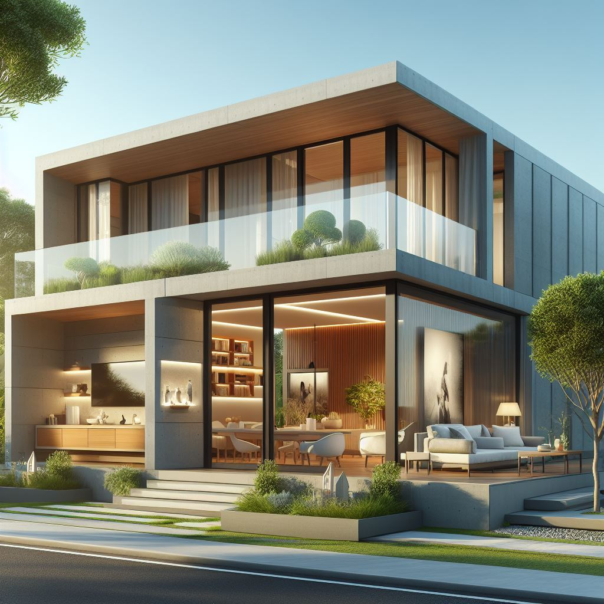

# SMART HOME

## DOCUMENTATION DU PROJET SMART-HOME RÉALISER PAR LES ETUDIANTS D'ESEO2-TOGO 

ce projet à éte réaliser par :
* ATADEGNON KODJO PIERRE : Kpatadegnon@gmail.com
* AWENA PIRENA ODETTE : awenaodette28@gmail.com
* GNASSINBGE EMILIE : 
* LEENAERTS LOIC HARRY :
* MEGUIDA ADEBAYO MOURAD :
* NONVIGNON KOKOU KENNETH :
* NADJOMBE ADAMA :

## Image de la maison / Vidéo

  ## Description du projet 

La **smart home**, également connue sous le nom de **maison intelligente**, est un concept qui intègre les nouvelles technologies pour améliorer le confort des occupants. Dans une smart home, les appareils sont connectés entre eux, et leur contrôle est centralisé. Par des **Technologies avancées** comme l'intelligence artificielle, la reconnaissance vocale ou faciale, et la lecture des empreintes digitales pour faciliter la vie quotidienne ensuite par la **Communication entre appareils** Les différents équipements (ampoules, volets, prises, thermostats, etc.) communiquent entre eux via un réseau de communication. Cela permet un contrôle à distance et une automatisation des tâches. Également, par **Confort personnalisé** : Grâce à la mise en place de scénarios et de régulations pièce par pièce, la smart home s'adapte aux besoins spécifiques de chaque occupant. Elle anticipe les besoins en termes de climat intérieur, de sécurité, et de gestion énergétique.  **Collaboration avec différents corps de métiers** : La mise en place d'une smart home nécessite une réflexion dès les premiers plans de construction. Elle implique une coordination avec l'architecte, le constructeur, le menuisier, le chauffagiste, l'électricien, et le plombier pour intégrer les capteurs, les systèmes de régulation, et les vannes commandées.

En somme, la smart home vise à rendre notre quotidien plus pratique, confortable et économe en énergie, tout en utilisant les dernières avancées technologiques

  ## REMERCIEMMENTS 

  ## Sommaire
1. Introduction et objectifs du projet
   
2. Technologies utilisée
  a. Analyse fonctionnelle  
  b. Analyse technique

4. Evolution du projet
   
5. Conclusion

## 1. Introduction et objectifs du projet 

La smart home se définit comme une habitation équipée de systèmes automatisés qui facilitent la gestion quotidienne des tâches domestiques et des services via une interface centrale. Ces systèmes sont souvent dotés de capacités d'intelligence artificielle, permettant une interaction naturelle avec les occupants à travers la reconnaissance vocale. L'objectif est de créer un environnement qui non seulement répond intelligemment aux besoins des résidents, mais anticipe également ces besoins pour offrir un confort sur mesure.

En examinant les différentes technologies impliquées, la communication entre appareils et l'importance d'une collaboration multidisciplinaire dans la conception des smart homes, cette documentation vise à démontrer comment l'intégration de ces éléments peut significativement améliorer la qualité de vie. Nous analyserons également les implications de cette technologie pour la durabilité et l'efficacité énergétique, soulignant ainsi son rôle potentiel dans la promotion d'un avenir plus durable.

## objectifs du projet 

L'objectif de ce rapport est de fournir une analyse approfondie du concept de smart home, ou maison intelligente, en examinant comment l'intégration de technologies avancées peut améliorer significativement le confort, la sécurité et l'efficacité énergétique des habitats. Le rapport vise à :

1. Expliquer le fonctionnement de smart home :
    Démontrer comment les technologies telles que l'intelligence artificielle, les réseaux de communication et la domotique interagissent pour créer des environnements de vie qui anticipent et répondent aux besoins des occupants.
   
2. Les difficultés rencontés
   
3. Les sources

## 2. Technologies utilisée
